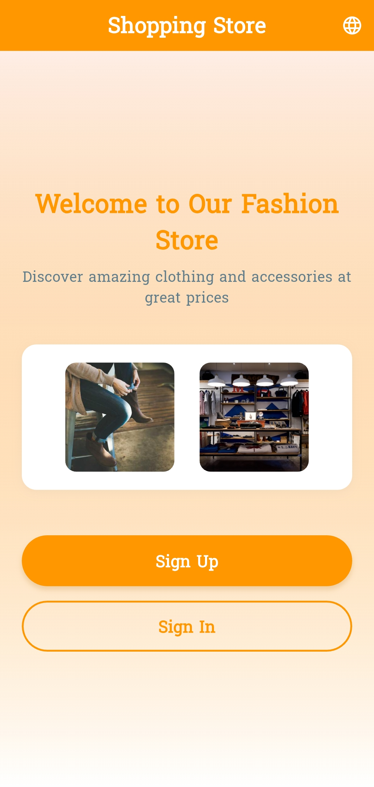
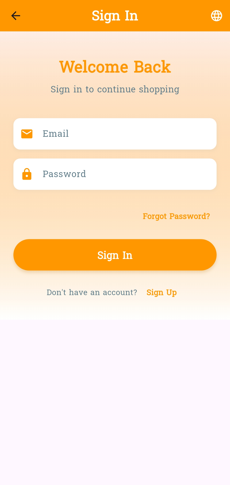
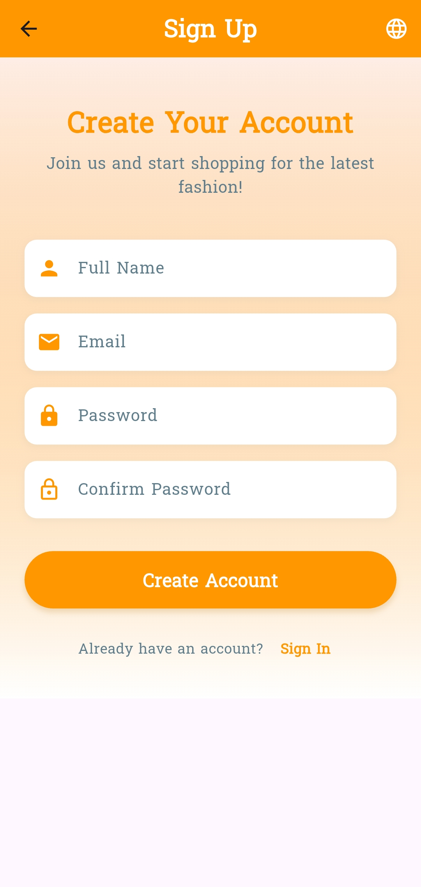
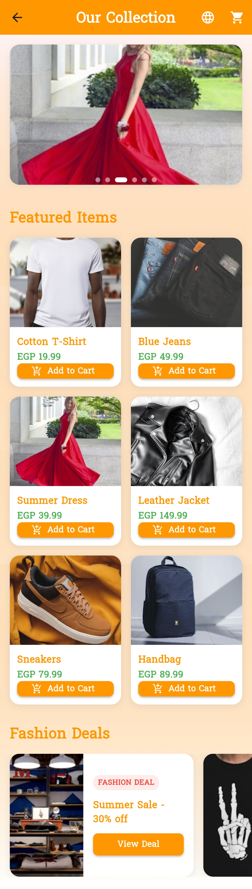
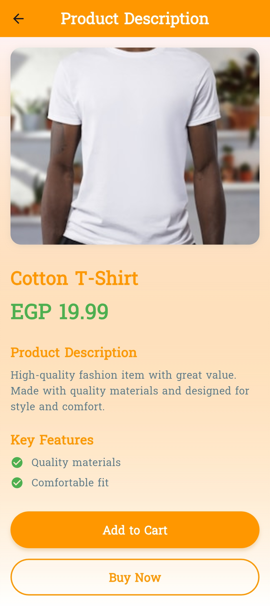

# Flutter Shopping App

A comprehensive Flutter project simulating a real-world shopping application. This app demonstrates Dart programming concepts, modular Flutter UI, user authentication, product browsing, cart interactions, and full localization (English & Arabic).

## Features

- **Aesthetic Welcome Screen**
  - Custom AppBar, local & online images, custom font (Suwannaphum)
  - Centered layout with Sign-up and Sign-in buttons
- **User Authentication**
  - Sign-up and Sign-in forms with validation (name, email, password)
  - Success dialogs and navigation to main app
- **Animated Navigation**
  - Smooth fade transitions between screens
- **Shopping Home Screen**
  - AppBar titled "Our Collection" (localized)
  - Horizontal PageView for featured products
  - Responsive GridView for product cards (2 per row)
  - Add to Cart with SnackBar feedback
  - "Hot Offers" section with ListView.builder
- **Localization**
  - Full support for English and Arabic
  - All UI strings managed via .arb files (no hardcoded text)
- **Custom Fonts & Styling**
  - Uses Suwannaphum-Regular font for a unique look
- **Clean Code & Structure**
  - Each widget/class in a separate file
  - Modular, readable, and well-documented codebase

## Screenshots

<div style="display: flex; flex-wrap: wrap; gap: 10px; align-items: flex-start;">

  
  
  
  
  

</div>

## Getting Started

1. **Clone the repository:**
   ```sh
   git clone https://github.com/ahmedkhatab17/shopping_app
   cd flutter_shopping_app
   ```
2. **Install dependencies:**
   ```sh
   flutter pub get
   ```
3. **Run the app:**
   ```sh
   flutter run
   ```

## Project Structure

- `lib/`
  - `models/` – Data models (Product, Offer, User)
  - `screens/` – App screens (Welcome, SignIn, SignUp, Home, Product Details)
  - `widgets/` – Reusable UI components (ProductCard, OfferItem, etc.)
  - `utils/` – Styles, transitions, validators
  - `l10n/` – Localization files (.arb)
- `assets/` – Images and fonts

## Localization

- English and Arabic supported
- All text is localized using Flutter Intl and .arb files
- To add more languages, add new .arb files in `lib/l10n/`

## Author

- Ahmed Khatab
